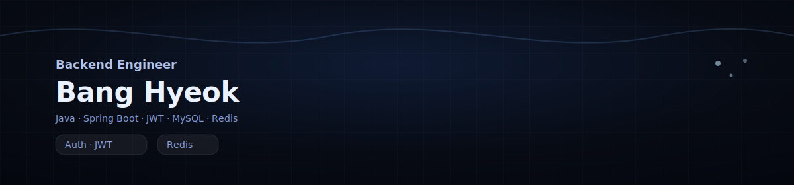

  

# 🐶 안녕하세요. 방혁입니다. 

### 🔙 Backend Developer 
- Spring Boot를 주력으로 안정적이고 확장 가능한 API를 설계하고 구현합니다.
- JWT 기반 인증/인가, MySQL/JPA, Redis를 활용한 서비스 개발 및 운영 경험이 있습니다.
- 대규모 트래픽 처리를 위한 시스템 아키텍처에 관심이 많으며, Redis 분산 캐시 라우팅 알고리즘인 D-HASH를 개발해 성능 최적화를 연구하고 논문을 작성한 경험이 있습니다.
- Blog: [hzeror.blog](https://bh1848.github.io/hzeror)
- Email: bh1848@naver.com

### 🥷 Skills

  
  
  
  
  
  
  
  
  
  

## 🔬 Research & Engineering

### D-HASH: 분산 캐시 Hot-key 해결 알고리즘 개발 (SCIE)
  

> **Hot-key로 인한 서버 부하 불균형을 해결하는 동적 라우팅 기법**

- **Problem:** 특정 키 요청 증가(Hot-key) 시 발생하는 단일 노드 과부하
- **Solution:** 실시간 접근 빈도 감지 및 **동적 라우팅 알고리즘** 개발
- **Impact:** Consistent Hashing 대비 **부하 표준편차 33.8% 감소**
- **Role:** 알고리즘 개발, 실험 설계·구현·분석, 논문 작성 (제1저자)
- **Links:** [🐙 GitHub Repository](https://github.com/bh1848/D-HASH) | [📝 Paper (SCIE / TIIS 2026)](https://doi.org/10.3837/tiis.2026.xx.xxx)

 

### MySQL vs Redis 성능 비교 벤치마크 (KCI)
   

> **RDBMS(MySQL)와 NoSQL(Redis)의 실제 응답 속도(Latency) 비교·분석**

- **Goal:** 데이터 연산 유형에 따른 DB별 성능 비교
- **Result:** Redis가 MySQL 대비 **평균 7.8배 빠름**을 입증 (1.39ms vs 0.17ms)
- **Insight:** 실제 시스템에서의 캐시 도입 기준 확립
- **Role:** 실험 설계·구현·분석 (제1저자)
- **Links:** [🐙 GitHub Repository](https://github.com/bh1848/mysql-redis-benchmark) | [📜 Paper (KCI / JICS 2024)](https://www.kci.go.kr/kciportal/ci/sereArticleSearch/ciSereArtiView.kci?sereArticleSearchBean.artiId=ART003098301)

 

## 👨‍💻 Projects

### 🐣 동구라미 (2024.05 ~ 2025.03)
- **Summary:** 동아리 지원 · 홍보 · 관리 통합 플랫폼
- **Repo:** [USW-Circle-Link-Server](https://github.com/bh1848/USW-Circle-Link-Server)
- **Tech:** `Spring Boot` `Spring Security` `JWT` `Docker` `MySQL` `Redis` `AWS`

### 🤼‍♀️ 수챗 (2023.09 ~ 2024.10)
- **Summary:** 대학교 랜덤 채팅 및 실시간 매칭 서비스
- **Repo:** [suchat-backend](https://github.com/bh1848/suchat-backend)
- **Tech:** `Spring Boot` `Spring Security` `JWT` `MySQL` `Redis` `AWS`

### ♻️ 요분정 (2024.09 ~ 2024.11)
- **Summary:** 딥러닝 기반 쓰레기 분류 및 포인트 적립 서비스
- **Repo:** [yobunjung-backend](https://github.com/bh1848/yobunjung-backend)
- **Tech:** `Flask` `MySQL` `ONNX` `SSE`

### 😴 졸음운전 방지 시스템 (2023.09 ~ 2023.11)
- **Summary:** 운전자 눈 깜빡임 감지를 통한 졸음운전 예방 솔루션
- **Repo:** [drowsy-driving-prevention](https://github.com/bh1848/drowsy-driving-prevention)
- **Tech:** `Python` `OpenCV` `Dlib`
 

## 🏆 Baekjoon Solved Rank

