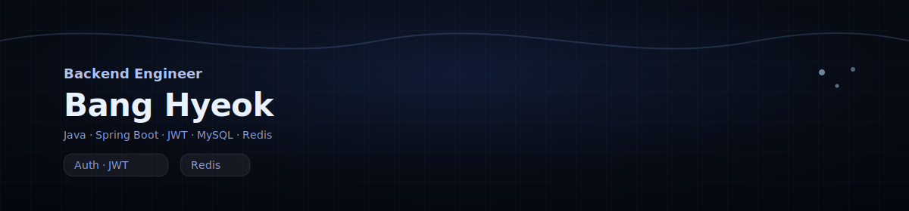

  

# 안녕하세요. 백엔드 개발자 방혁입니다.

> **"대용량 트래픽 환경의 성능 최적화와 보안 아키텍처 설계에 집중합니다."**

- **Email:** bh1848@naver.com
- **Blog:** [banghyeok.blog](https://velog.io/@bh1848/posts)

### Skills
**Main**

  
  
  
  
  
  
  
  
  
  
  

**Sub**

  
  

 

## Featured Research

### [D-HASH: 분산 캐시 Hot-key 해결을 위한 동적 해싱 알고리즘](https://github.com/bh1848/D-HASH)
> **대규모 트래픽 환경의 특정 노드 부하 집중 문제를 해결하는 알고리즘 연구**

- **Publication**: [TIIS 2026 게재 예정 (SCIE 제1저자)]
- **Impact**: **부하 불균형 33.8% 개선** (NASA 웹 로그 기반 Consistent Hashing 대비)

#### Key Achievements & Troubleshooting
- **[연산 효율 최적화]** MD5 병목을 `xxHash64`로 교체하고 `__slots__`를 적용하여 **속도 20배 향상 및 메모리 50% 절감**
- **[응답 지연 방어]** Guard Phase 설계를 통해 노드 전환 시 발생하는 **Latency Spike 방어**
- **[부하 검증]** 비동기 I/O 모델 기반 테스트 툴을 개발하여 **180,000 OPS급 고부하 테스트 환경 검증**
- **[데이터 정합성]** 분산 환경의 데이터 파편화를 막기 위해 **Write-Primary 정책** 설계

[[**트러블슈팅 확인하기**]](https://github.com/bh1848/D-HASH/blob/main/docs/REPORT_KR.md#5-트러블슈팅)

 

### [MySQL vs Redis 성능 비교 벤치마크](https://github.com/bh1848/mysql-redis-benchmark)
> **저장 매체 및 데이터 구조 차이에 따른 기술적 의사결정 근거 수립 연구**

- **Publication**: [JICS 2024 게재 (KCI 제1저자)](https://www.kci.go.kr/kciportal/ci/sereArticleSearch/ciSereArtiView.kci?sereArticleSearchBean.artiId=ART003098301)
- **Impact**: 연산 유형별 성능 차이(평균 7.8배) 수치화를 통해 **캐시 도입의 객관적 기술 근거 마련**

#### Key Achievements & Troubleshooting
- **[측정 신뢰도 확보]** Connection Warm-up 및 로직 추상화로 **환경 간섭에 따른 오차 제거**
- **[정밀 지표 도출]** 산술 평균 방식을 적용하여 **0.17ms 단위의 정밀한 데이터 확보**
- **[구조적 분석]** B-Tree와 Hash 구조의 차이를 검증하여 **상황별 최적의 저장소 선택 가이드 수립**

[[**트러블슈팅 확인하기**]](https://github.com/bh1848/mysql-redis-benchmark#4-트러블슈팅)

 

## Impactful Projects

### [동구라미: 대학교 동아리 통합 관리 플랫폼](https://github.com/bh1848/USW-Circle-Link-Server)
> **2024.05 - 2025.03 | 백엔드 설계 및 API 개발 (팀 12인 - BE 4, FE 7, DE 1)**
- **Core**: JWT/Redis RTR 보안 아키텍처 및 JPA 벌크 연산 최적화

#### Key Achievements & Troubleshooting
- **[DB 성능 최적화]** JPQL Bulk 연산 적용으로 **쿼리 실행 수 90% 이상 절감 (2N+2 → 10 고정)**
- **[구조 설계 개선]** 책임 연쇄(CoR) 패턴을 도입해 복잡한 인증 로직을 **유지보수가 쉬운 파이프라인으로 개편**
- **[보안 강화]** S3 Presigned URL 도입을 통한 **서버 부하 분산** 및 공통 인터셉터 단의 **보안 취약점(XSS, 부정 파일) 방어**
- **[운영 가시성 확보]** MDC 기반 로그 추적 시스템 구축으로 분산 환경에서의 **장애 대응 효율 개선**
- **[인프라 최적화]** S3 Presigned URL 도입으로 **서버 부하를 분산**하고 브라우저 보안 정책(SameSite) 대응

[[**트러블슈팅 확인하기**]](https://github.com/bh1848/USW-Circle-Link-Server#6-트러블슈팅)

 

### [수챗: 대학교 커뮤니티 기반 랜덤 채팅 서비스](https://github.com/bh1848/suchat-backend)
> **2023.09 - 2024.05 | 백엔드 아키텍처 및 매칭 엔진 개발 (팀 5인)**
- **Core**: Redis ZSet 기반 매칭 엔진 및 JWT/Redis 보안 아키텍처

#### Key Achievements & Troubleshooting
- **[매칭 병목 해결]** 동기 방식의 병목을 해결하기 위해 **Redis ZSet과 `@Async` 비동기 조합**을 도입하여 처리 효율 극대화
- **[상태 동기화]** 분산 환경의 매칭 불일치를 **Redis Atomic 연산**으로 해결하여 정합성 보장
- **[인증 보안]** Redis TTL 기반 **RTR(Refresh Token Rotation)** 적용으로 토큰 탈취 리스크 방어
- **[리소스 관리]** 스케줄러 기반의 클리닝 프로세스를 구축해 **DB 무결성 및 성능 유지**

[[**트러블슈팅 확인하기**]](https://github.com/bh1848/suchat-backend/#6-트러블슈팅)

 

### Baekjoon Solved Rank

